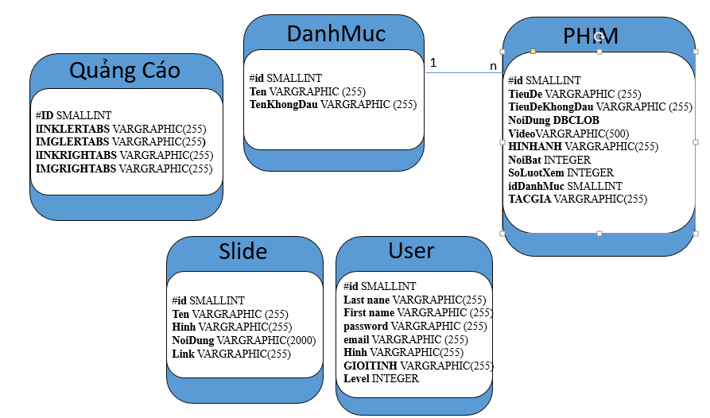
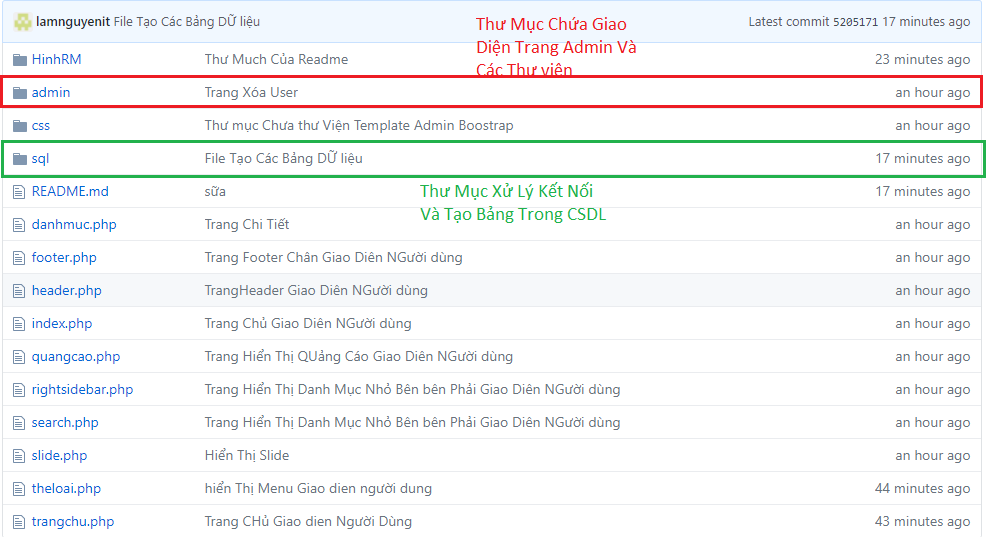
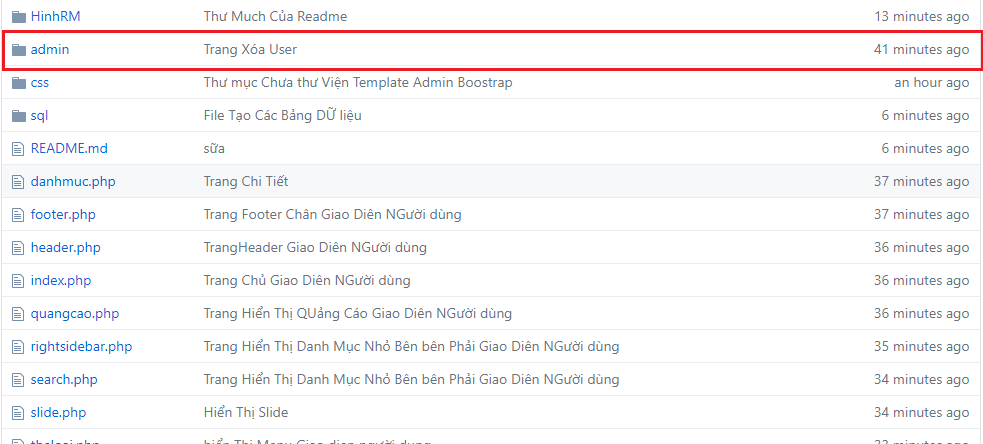
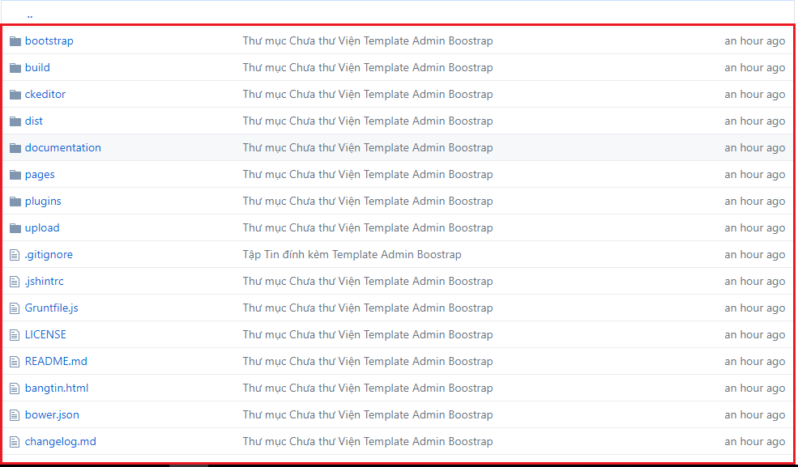
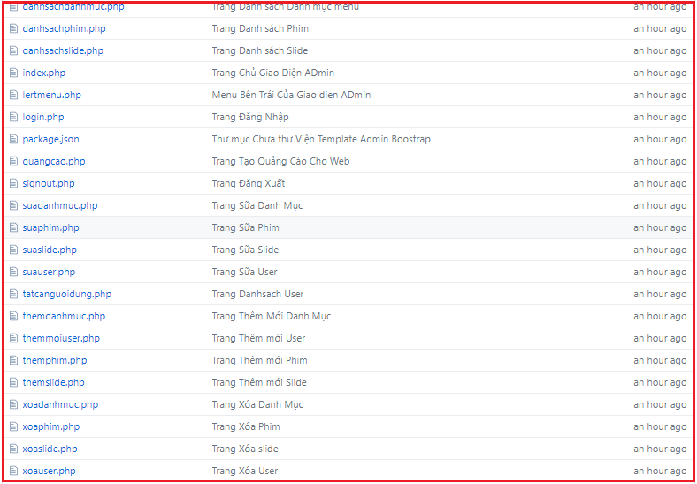
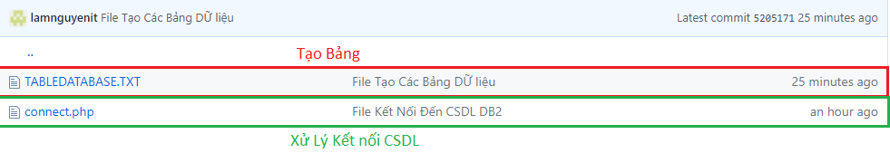

<h1 style="text-align: center;">Xây Dựng WebSite Xem Phim</h1>

<h3>I. Tạo CSDL</h3>

<h4>Trong Đó: (Mình Tạo Bằng Dòng lệnh)</h4>
<h5>Bảng Danh Mục</h5>

CREATE TABLE PHIM.DANHMUC(ID SMALLINT PRIMARY KEY NOT NULL GENERATED ALWAYS AS IDENTITY(START WITH 1 INCREMENT BY 1),TEN VARGRAPHIC(255) NOT NULL,TENKHONGDAU VARGRAPHIC(255) NOT NULL)

<h5>Bảng Phim</h5>

CREATE TABLE PHIM.PHIM(ID SMALLINT PRIMARY KEY NOT NULL GENERATED ALWAYS AS IDENTITY(START WITH 1 INCREMENT BY 1),TIEUDE VARGRAPHIC(255) NOT NULL,TIEUDEKHONGDAU VARGRAPHIC(255) NOT NULL,NOIDUNG DBCLOB,VIDEO VARGRAPHIC(500) NOT NULL,HINHANH VARGRAPHIC(255) NOT NULL,NOIBAT INTEGER NOT NULL,SOLUOTXEM INTEGER NOT NULL,IDDANHMUC SMALLINT NOT NULL FOREIGN REFERENCES PHIM.DANHMUC(ID) ON DELETE cascade,TACGIA VARGRAPHIC(255) NOT NULL)

<h5>Bảng User</h5>

CREATE TABLE PHIM.USER(ID SMALLINT PRIMARY KEY NOT NULL GENERATED ALWAYS AS IDENTITY(START WITH 1 INCREMENT BY 1),LASTNAME VARGRAPHIC(255) NOT NULL,FIRSTNAME VARGRAPHIC(255) NOT NULL,EMAIL VARGRAPHIC(255)NOT NULL,PASSWORD VARGRAPHIC(255) NOT NULL,NGAYSINH DATE NOT NULL,HINH VARGRAPHIC(255) NOT NULL,GIOITINH VARGRAPHIC(255) NOT NULL,LEVEL INTEGER NOT NULL)

<h5>Bảng Slide</h5>

CREATE TABLE PHIM.SLIDE(ID SMALLINT PRIMARY KEY NOT NULL GENERATED ALWAYS AS IDENTITY(START WITH 1 INCREMENT BY 1),TEN VARGRAPHIC(255) NOT NULL,HINH VARGRAPHIC(255) NOT NULL,NOIDUNG VARGRAPHIC(2000) NOT NULL,LINK VARGRAPHIC(255) NOT NULL,HIENTHI INTERGER NULL)

<h5>Bảng Quảng Cáo</h5>

CREATE TABLE PHIM.QUANGCAO(ID SMALLINT PRIMARY KEY NOT NULL GENERATED ALWAYS AS IDENTITY(START WITH 1 INCREMENT BY 1),lINKLERTABS VARGRAPHIC(255) NOT NULL,IMGLERTABS VARGRAPHIC(255) NOT NULL,lINKRIGHTABS VARGRAPHIC(255) NOT NULL,IMGRIGHTABS VARGRAPHIC(255) NOT NULL,HIENTHI VARGRAPHIC(50))

<h3>II.Bố Cục Source Code</h3>
<h5>Bố Cục Gồm 3 Phần Chính</h5>

*Thư Mục chứa code Giao Diên Admin Và Thư viện *Thư Mục Chứa Kết Nối Và Tạo Bảng Trong CSDL DB2  *Phân còn lại chứa Code PHP giao diện người dùng

<h6>1.Thư Mục Chứa Các Thư Viện Và Các File PHP giao diên Admin</h6>

Bên Trong Thư Mục Admin Gôm Có 

a. Các file Thư Viên Và tệp Đính kèm Được xây dựng sẵn Bởi Template Boostrap

b.Các file PHP giao diên Admin Được Nhóm Phát triển Phần mềm Viết Ra

<h6>2.Thư Mục Chứa Kết Nối Và Tạo Bảng Trang CSDL</h6>
