

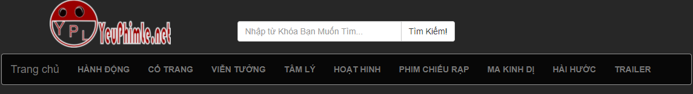

<h1 style="text-align: center;">Xây Dựng WebSite Xem Phim</h1>

<h2>Lời nói đầu</h2>

Internet là tài nguyên vô tận với con người trong mọi lĩnh vực.Internet là mạng máy tính khổng lồ được kết nối lại với nhau. Bất cứ vị trí , khoảng cách hoặc thời gian nào, một máy tính kết nối vào mạng Internet đều được coi là thành viên của mạng Internet Nhầm hướng tới nhu cầu xem phim của mọi người . Xem phim nhanh hơn .Chúng Tôi Hướng tới Xây dựng 1 website xem phim. Để đáp ứng với nhu cầu càng lớn của cua người, giúp mọi người có thể thưởng thức những bộ phim hay. Đáp ứng nhu cầu thư giãn giải trí của con người sau giờ làm việc mệt mỏi. Bắt kịp xu thế phát triển của ngành công nghiệp sản xuất phim trên thế giới.

<h2>Nhóm Thực Hiện</h2>
<ol>
<li>Nguyễn Trọng Lâm</li>
<li>Nguyễn Trung Hiếu</li>
<li>Nguyễn Hồng Phú</li>
<li>Huỳnh Huy Hùng </li>
<li>Trần Minh Hoàng</li>
</ol>

Page:<a href="https://www.facebook.com/yeuphimle.net/">Facebook.com/yeuphimle.net</a>

<h2>Mục tiêu của đề tài</h2>

Cung cấp kho phim hay và độc đáo cho người xem qua những bộ phim mới.
 	Cung cấp đến người xem những thể loại phim bổ ích.
 	Phát triển website với quy mô lơn hơn để đáp ứng với nhu cầu thực tế hiện nay.

<h2>I. Tạo CSDL</h2>

<h3>Trong Đó: (Mình Tạo Bằng Dòng lệnh)</h3>
<h4>Bảng Danh Mục</h4>

CREATE TABLE PHIM.DANHMUC(ID SMALLINT PRIMARY KEY NOT NULL GENERATED ALWAYS AS IDENTITY(START WITH 1 INCREMENT BY 1),TEN VARGRAPHIC(255) NOT NULL,TENKHONGDAU VARGRAPHIC(255) NOT NULL)

<h4>Bảng Phim</h4>

CREATE TABLE PHIM.PHIM(ID SMALLINT PRIMARY KEY NOT NULL GENERATED ALWAYS AS IDENTITY(START WITH 1 INCREMENT BY 1),TIEUDE VARGRAPHIC(255) NOT NULL,TIEUDEKHONGDAU VARGRAPHIC(255) NOT NULL,NOIDUNG DBCLOB,VIDEO VARGRAPHIC(500) NOT NULL,HINHANH VARGRAPHIC(255) NOT NULL,NOIBAT INTEGER NOT NULL,SOLUOTXEM INTEGER NOT NULL,IDDANHMUC SMALLINT NOT NULL FOREIGN REFERENCES PHIM.DANHMUC(ID) ON DELETE cascade,TACGIA VARGRAPHIC(255) NOT NULL)

<h4>Bảng User</h4>

CREATE TABLE PHIM.USER(ID SMALLINT PRIMARY KEY NOT NULL GENERATED ALWAYS AS IDENTITY(START WITH 1 INCREMENT BY 1),LASTNAME VARGRAPHIC(255) NOT NULL,FIRSTNAME VARGRAPHIC(255) NOT NULL,EMAIL VARGRAPHIC(255)NOT NULL,PASSWORD VARGRAPHIC(255) NOT NULL,NGAYSINH DATE NOT NULL,HINH VARGRAPHIC(255) NOT NULL,GIOITINH VARGRAPHIC(255) NOT NULL,LEVEL INTEGER NOT NULL)

<h4>Bảng Slide</h4>

CREATE TABLE PHIM.SLIDE(ID SMALLINT PRIMARY KEY NOT NULL GENERATED ALWAYS AS IDENTITY(START WITH 1 INCREMENT BY 1),TEN VARGRAPHIC(255) NOT NULL,HINH VARGRAPHIC(255) NOT NULL,NOIDUNG VARGRAPHIC(2000) NOT NULL,LINK VARGRAPHIC(255) NOT NULL,HIENTHI INTERGER NULL)

<h4>Bảng Quảng Cáo</h4>

CREATE TABLE PHIM.QUANGCAO(ID SMALLINT PRIMARY KEY NOT NULL GENERATED ALWAYS AS IDENTITY(START WITH 1 INCREMENT BY 1),lINKLERTABS VARGRAPHIC(255) NOT NULL,IMGLERTABS VARGRAPHIC(255) NOT NULL,lINKRIGHTABS VARGRAPHIC(255) NOT NULL,IMGRIGHTABS VARGRAPHIC(255) NOT NULL,HIENTHI VARGRAPHIC(50))

<h2>II.Bố Cục Source Code</h2>
<h4>Bố Cục Gồm 3 Phần Chính</h4>

*Thư Mục chứa code Giao Diên Admin Và Thư viện *Thư Mục Chứa Kết Nối Và Tạo Bảng Trong CSDL DB2  *Phân còn lại chứa Code PHP giao diện người dùng

<h4>1.Thư Mục Chứa Các Thư Viện Và Các File PHP giao diên Admin</h4>

Bên Trong Thư Mục Admin Gôm Có 

a. Các file Thư Viên Và tệp Đính kèm Được xây dựng sẵn Bởi Template Boostrap

b.Các file PHP giao diên Admin Được Nhóm Phát triển Phần mềm Viết Ra

<h4>2.Thư Mục Chứa Kết Nối Và Tạo Bảng Trang CSDL</h4>

<h2>III. Chức Năng Đã Hoàn Thành Của Web</h2>
<h3>1. Giao Diện Người Dùng</h3>

Đếm Số Lượt Xem Tương Tác Với Website

Mỗi Lần Người Dùng Click Xem Phim Thì Lượt Xem được cộng thêm 1

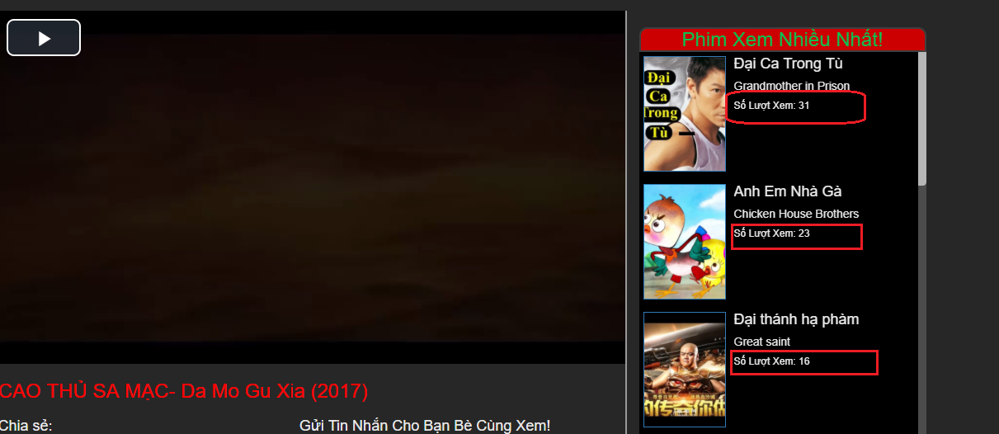
<h4>2. Chức Năng xem Phim Và Like Share Gửi Tin Nhắn Bằng FaceBook</h4>
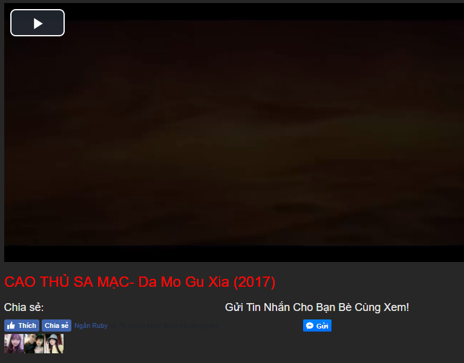
<h4>3. Chức Năng Comment Bằng FaceBook</h4>
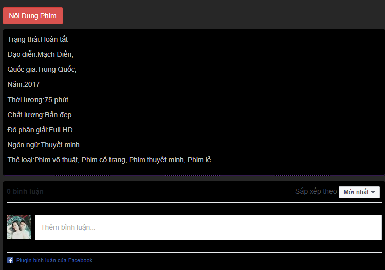
<h4>4. MENU Động Lấy Từ Danh Mục Trong CSDL</h4>
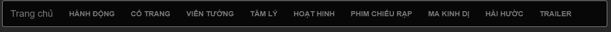
<h4>5.Chức Năng Tìm Kiếm Theo Tên</h4>
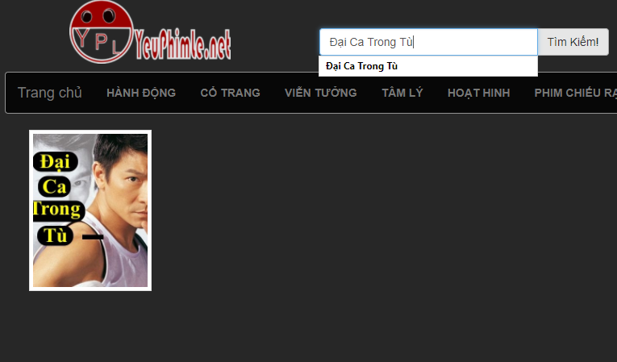
<h2>IV. Chức Năng Giao Điện Admin Đã Hoàn Thành</h2>
<h4>1. Chức Năng Đăng Nhập Và Đăng Xuất</h4>

Đăng Nhập Bằng Email

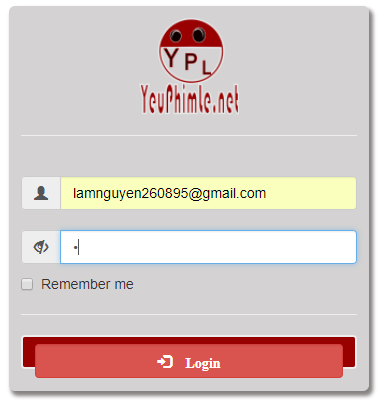

Đăng Xuất

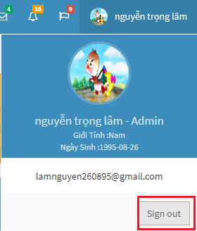
<h4>2. Chức Năng Thêm Xóa Sửa Thành Viên</h4>

Thêm Thành Viên

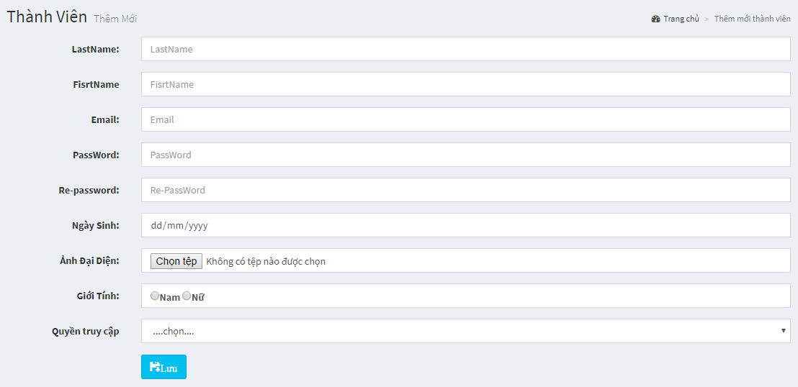

Xóa Sửa Thành Viên

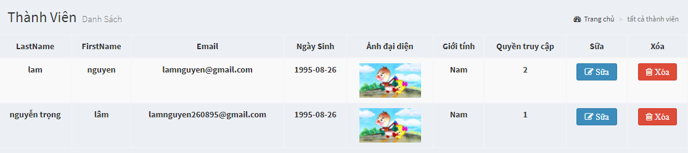
<h4>3. Chức Năng Thêm Xóa Sữa Danh Mục</h4>

Thêm Danh Mục

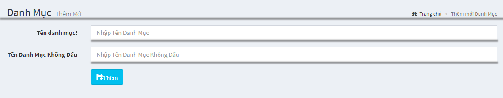

Xóa Sữa Danh Mục

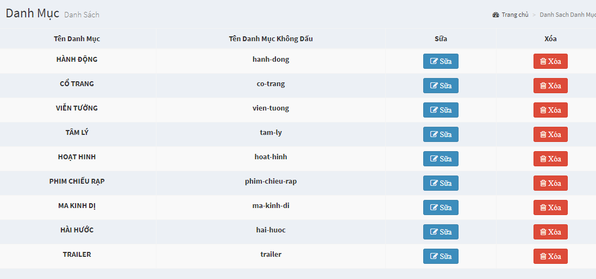
<h4>4. Chức Năng Thêm Xóa Sữa Slide</h4>

Thêm Slide

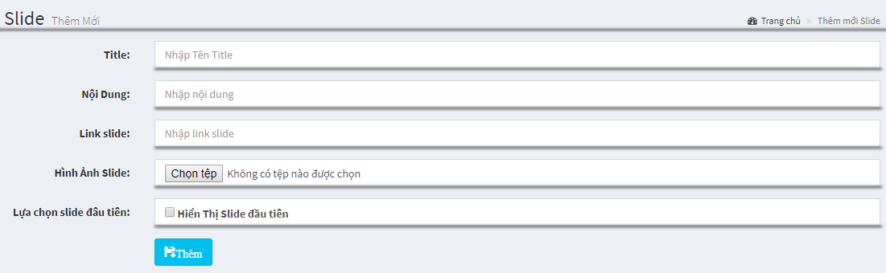

Xóa Sữa Slide

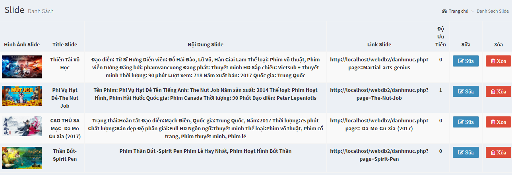
<h4>3. Chức Năng Thêm Xóa Sữa Phim</h4>

Thêm Phim

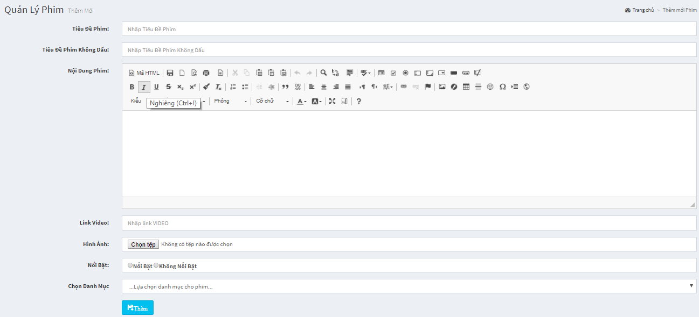

Xóa Sữa Phim

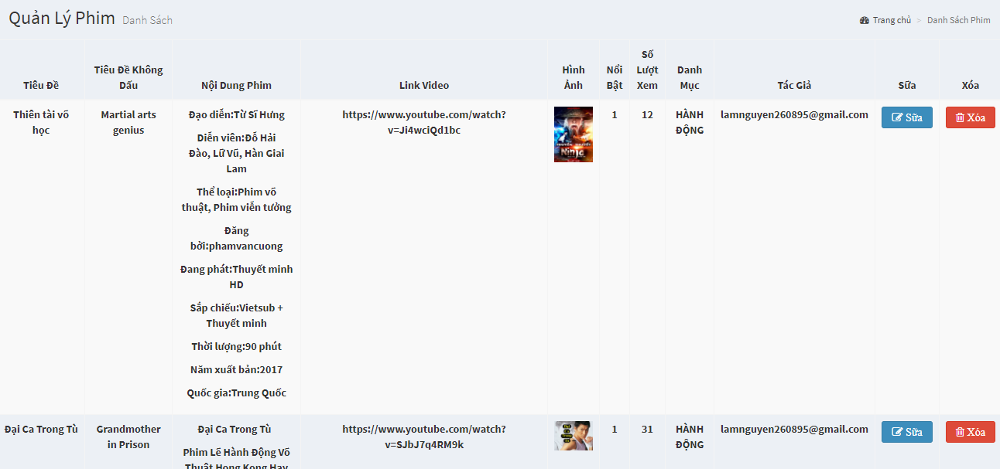
<h4>3. Chức Năng Cập Nhật Quảng Cáo</h4>
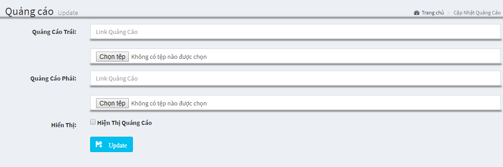
<h2>V. Mục Tiêu Phát triển Trong Tương Lai</h2>
<li>Tối Ưu Hóa Source Code </li>
<li>Nâng Cấp Kho Dữ Liệu Phim </li>
<li>Cập Nhật Một số Tính Năng mới Đáp ứng nhu cầu người dùng và thời đại</li>
<li>Xử Lý Những Khuyết điểm trong Version 1.0 này!!! Hứa Hẹn Vào 1 Website bùng nổ Trong Tương Lai! </li>
